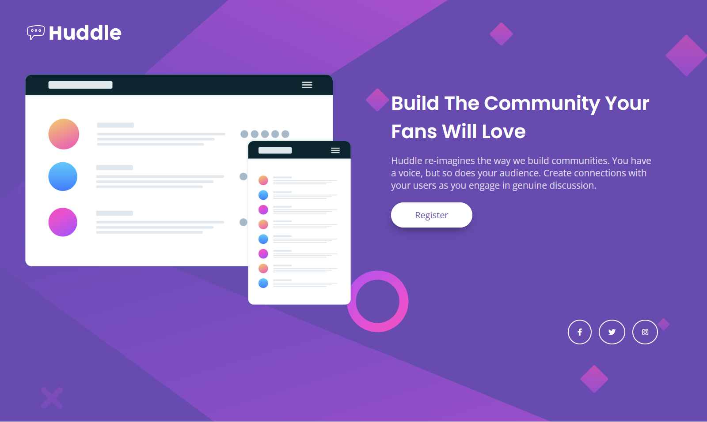

# Frontend Mentor - Huddle landing page with single introductory section

This is a solution to the [Huddle landing page with single introductory section on Frontend Mentor](https://www.frontendmentor.io/challenges/huddle-landing-page-with-a-single-introductory-section-B_2Wvxgi0). Frontend Mentor challenges help you improve your coding skills by building realistic projects.

### Screenshot

### Links

- Solution URL: [Huddle landing page with single introductory section solution](https://your-solution-url.com)
- Live Site URL: [Huddle landing page with single introductory section site](https://lovely-flan-42307d.netlify.app/)

### Built with

- Semantic HTML5 markup
- CSS custom properties
- Flexbox
- Desktop-first workflow

### What I learned

A really good fun project to practice flex and make it responsive all tho kinda sturggled with social media icons but managed to get thru it.

### Useful resources

- [Awesome Screenshot and Screen Recorder](https://chrome.google.com/webstore/detail/awesome-screenshot-and-sc/nlipoenfbbikpbjkfpfillcgkoblgpmj) - excellent webpage screenshot extension for google chrome .
- [w3schools](https://www.w3schools.com/) - a very good site if you ever get lost.
- [Font Awesome](https://fontawesome.com/) - if you need icons.

## Author

- Frontend Mentor - [@anaschaouki](https://www.frontendmentor.io/profile/anaschaouki)

## Acknowledgments

I would like to give a big Thank you to anyone who helped by providing feedback on my solution.
